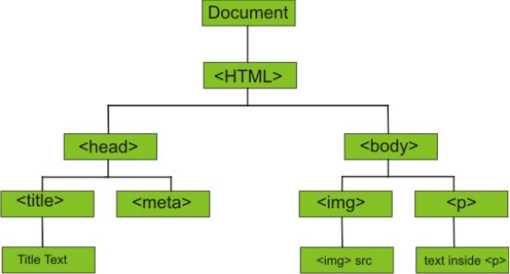
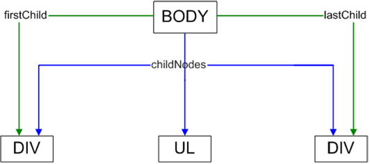
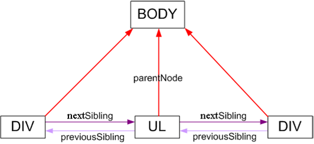

# JavaScript

В веб-разработке мы однозначно будем сталкиваться с языком JavaScript. И если программировать мы на нем не собираемся,
то хотя бы понимать синтаксис желательно.

## Подключение JavaScript

В веб разработке следующее разделение ролей: HTML отвечает за структуру документа, стили за его внешний вид, а скрипты
— за поведение. С помощью скриптов, например, можно «оживлять» страницу, добавляя анимацию и другие эффекты, которые
создаются с помощью языка JavaScript.

JavaScript - объектно-ориентированный язык программирования, в первую очередь предназначенный для создания
интерактивных (т.е. изменяющихся без перезагрузки) web-страниц

Стандартизированная версия JavaScript, называемая ECMAScript, работает одинаково во всех приложениях, поддерживающих
стандарт.

Скрипты подключаются так же, как и стили: их или пишут внутри страницы, или подключают как внешние файлы.
Встроенные скрипты пишут внутри тега `<script>`. Например:

```javascript
<script>
    JavaScript-код
</script>
```

Тег `<script>` можно использовать в любом месте HTML-документа, но лучше вставлять его в самом конце перед закрывающим
тегом `</body>`.

Часть возможностей JavaScript постепенно переходит в CSS, например, возможность задавать плавное изменение значений
свойств.

Скрипты чаще всего подключают из внешних файлов с расширением `.js`. Для этого используют тег `<script>` с
атрибутом `src`, в
котором указывается путь к файлу. Например:

```javascript
<script src="scripts.js"></script>
```

Обратите внимание, что тег `<script>` парный. Если вы подключаете внешние скрипты, то, что внутри тега браузером
игнорируется.
Внешние скрипты лучше подключать перед закрывающим тегом `</body>`.

## Типы данных и переменные

Основные типы данных в javascript:

- `string` - строка, какая-либо последовательность символов
- `number` - число (`2, 4, 1e10, 3.14` и т.д.)
- `bool` - логический тип данных, может принимать два значения: `true` or `false`
- `object` - объект
- `function` - функция
- `undefined` - тип данных не определен (аналог в Python `None`)

JavaScript - язык со свободными типами данных, т.е. можно проводить операции с различными типами данных (складывать
число и строку и т.д.)

### Переменные

Переменная в javascript начинается с буквы, знака доллара или подчеркивания и может содержать только буквы, знак
доллара, подчеркивание и цифры. Регистр, в котором написана переменная важен (`a` и `A` - разные переменные).

Создаются переменные очень просто:
`let имя` - создается пустая переменная
`let name=value` - создается переменная с заданным значением

### Константы

Ключевое слово `const` создаёт новую именованную константу, доступную только для чтения.
Синтаксис:

```javascript
const name1 = value1
```

Эта синтаксическая конструкция создаёт новую константу. Имена констант подчиняются тем же правилам, что и обычные
переменные. Значение константы нельзя менять/перезаписывать. Также её нельзя объявить заново.

### Приведение типов

Для проведения некоторых операция требуется преобразование одного типа данных в другой. Для этого существуют специальные
функции:

- `Number(выражение\переменная)` - преобразование в число, возвращает либо число, либо `NaN` (не число). Для логических
  величин возвращает `1` если `true` и `0` если `false`. Для строк пытается привести к числу (возможно преобразование в
  число
  таких строк, как "12312", "3,14" и т.д., при передачи в качестве параметра строки типа "7 дней" вернет `NaN`
- `parseInt(string[, base])` - пытается вернуть целое число, записанное в строке. Если указан необязательный
  параметр `base`,
  то считает число по основанию, указанному в base (`8`, `16`, по умолчанию - `10`, указывать не обязательно)
- поставить знак `+` перед строкой, что тоже приведет к переводу строки к числу `+"2"`
- `parseFloat(string)` - пытается преобразовать строку в вещественное число
- `String(выражение\переменная)` - преобразует данные в строковой формат. Для логических данных возвращает `true`
  or `false`,
  для `undefined` - пустую строку (`""`)
- Если к числу добавить пустую строку - это переведет данные в строковый формат `23 + ""`
- `Boolean(данные)` - приводит данные к логическому типу. `0` возвращается, если данные - пустая строка или `0`, а в
  остальных
  случаях возвращает `true`
- `Array(1[,2[,3...]])` - возвращает массив, состоящих из переданных команде элементов

Перевод числа в строку и обратно:

```javascript
let n = parseInt("3.14"); // 3
let n = parseFloat("3.14") // 3.14
let n = 5;
let m = n.toString();
let m = n + '';
let m = new String(n);
```

Узнать, к какому типу данных принадлежит значение переменной `myVar`, можно узнать с помощью оператора `typeof`:

```javascript
typeof myVar;
```

Вот список того, что этот оператор может вернуть:

- `undefined` (для `undefined`)
- `string` (для `String`)
- `number` (для `Number`)
- `boolean` (для `Boolean`)
- `object` (для всех объектных типов данных и `null`)
- `function` (для функций)

## Арифметические операторы

Операторы языка:

- `+` - сложение (для строк - конкатенация (склейка) строк)
- `-` - вычитание
- `*` - умножение
- `/` - деление
- `%` - остаток от деление (`a mod b`)
- `++` - увеличение на 1
- `--` - уменьшение на 1
- `+=a` - увеличение на `a`
- `-=a` - уменьшение на `a`
- `*=a` - умножение на `a`
- `/=a` - деление на `a`
- `%=a` - остаток от деление на `a`
-

Для работы с математическими функциями есть специальный объект `Math`, у которого есть свойства и методы. Этот объект –
свойство глобального объекта..
Math.функция

- `Math.abs(number)` - модуль числа
- `Math.floor(number)` - округление вниз
- `Math.ceil(number)` - округление числа вврех
- `Math.round(a)` - округление до ближайшего целого
- `Math.min(a,b), Math.max(a,b)` - минимальное или максимальное из двух чисел
- `Math.pow(a,b)` - `a` в степени `b`
- `Math.sqrt(a)` - квадратный корень из `a`
- `Math.random()` - случайное вещественное число в промежутке от 0 до 1
- `Math.PI` - число пи

Для арифметических операций существуют следующие специальные значения:

`NaN` (not-a-number) – результат числовой операции, которая завершилась ошибкой
`Infinity` – бесконечность 1.7976931348623157E+10308 (т.е. больше)
`-Infinity` – бесконечность -1.7976931348623157E+10308 (т.е. меньше)

Уникальность `NaN` – это значение не равно ничему, даже самому себе. Для проверки «нечисла» используется функция
глобального объекта `isNaN()`.

```javascript
isNaN(n);
```

где параметр `n` – проверяемый результат. Функция проверяет результат на «нечисло» и в случае «нечисла»
возвращает `true`

```javascript
isFinite(n);
```

, где `n` – проверяемый результат. Функция проверяет результат на «бесконечность» и «нечисло» . Для конечных чисел
возвращает `true`

## Логические операторы и операторы сравнения

Экземпляры логического типа данных `Boolean` имеют два возможных значения – `true` и `false`. Этот тип данных
используется
там, где есть проверка на соответствие условию. JavaScript легко преобразовывает типы данных из одного в другой, что
следует учитывать в таких операциях.

- `==` - равно
- `!=` - не равно
- `===` - строгое равно, без приведения типов
- `!==` - строгое не равно, без приведения типов
- `>` - больше
- `>=` - больше либо равно
- `<` - меньше
- `<=` меньше либо равно
- `!` - отрицание
- `&&` - и
- `||` - или

- Из любого типа данных можно получить логический тип данных с помощью двойного отрицания
-

```javascript
let x = 15;
let y = !!x; //вернет true
```

## Условные операторы

«Проверка условия» представляет собой операцию, в результате которой возвращается значение логического типа Boolean. Это
может любая проверка – наличие переменной или ее значения, сравнение двух переменных и т.д.

Работает это так: Ключевое слово `if` принимает некое выражение для проверки, и если выражение возвращает `true`,
выполняется блок инструкций, стоящий за этим ключевым словом. Совместно с ключевым словом `else` предыдущая конструкция
работает как триггер (переключатель). Если выражение проверки вернуло `false`, то выполняется блок инструкций, стоящий
после `else`. Выполниться может всегда только один блок инструкций в зависимости от результатов проверки условия.

`if  (условие) {code}` - если условие истинно, то выполняется код в { }

```javascript
if (условие) {
    code
    1
} else {
    code
    2
}
```

Если условие истинно, то выполняется code 1, иначе code 2

Для экономии ресурсов машины применяется инструкция переключения – выбор между заранее заданными вариантами. Эта
инструкция может быть полезна в случае заранее ограниченного выбора. Синтаксис этой инструкции отличается от других и
немного более сложен (наборы инструкций не объединяются в блоки).

```javascript
switch (выражение) {
    case value1:
        код;
        break;
    case value2:
        код2;
        break;
    default:
        код
}
```

Значение переменной сравнивается со значениями, стоящими после ключевых слов `case`. В случае равенства выполняются все
инструкции, стоящие после найденного совпадения. Ключевое слово `default` нужно для того, чтобы выполнился код в том
случае, когда не найдено ни одно совпадение. Например, вывел бы отрицательный результат поиска. Применение `default`
необязательно. Это ключевое слово может стоять в любом месте, а не только после всех case (в этом случае следует
заканчивать стоящий после него код инструкцией `break`).

Применение инструкции `break` приводит к тому, что все инструкции, идущие за ней, игнорируются и происходит переход к
коду, идущему за инструкцией переключения `switch`. Если не применять инструкцию break, то выполнятся все инструкции
после
первого найденного совпадения, что требуется не всегда. В этом принципиальное отличие `swith/case` от `if/else if/else`
– в
условной инструкции выполняется бок инструкций, соответствующий условию, а в инструкции переключения определяется только
точка входа в исполняемый код.

Тернарный оператор. Этот оператор состоит из 3-х частей:

- Проверка условия
- Значение, возвращаемое оператором в случае успешной проверки (true)
- Значение, возвращаемое оператором в противном случае (false)

`условие ? код 1 : код 2` - если условие истинно, выполняется код 1, иначе код 2

```javascript
(a > b) ? alert("Maximum a!") : alert("Maximum b!");
```

## Операторы цикла

Для выполнения повторяющихся действий применяются инструкции цикла. Любая такая инструкция связана, прежде всего, с
тремя обязательными шагами:

- Инициализация переменной (или переменной цикла)
- Проверка условия, связанного с переменной цикла
- Изменение переменной цикла
-

Любая инструкция цикла выполняет блок инструкций, если проверка условия возвращает `true`. В противном случае выполнение
цикла прекращается.

Цикл `for (инициализация, условие, изменение) {code}` - цикл выполняется до тех пор, пока условие истинно. Например

```javascript
for (i = 0; i < 13; i++) {
    a += a;
}
```

Основное отличие – инициализация, проверка и изменение переменной цикла стоят в одном месте, что облегчает код. В
разделе инициализации можно применить оператор `,`, объединив инициализацию или объявление нескольких переменных. Ровно
так же можно поступить и в разделе изменения – с помощью того же оператора `,` можно изменять значения нескольких
переменных.

Цикл `while (условие) {код}` - пока условие истино выполняем код

```javascript
let count = 0; //инициализация переменной цикла
while (count < 10) { //проверка переменной цикла блок инструкций
    count++; //изменение переменной цикла
}
```

Если проверка вернет `false`, блок инструкций не выполнится ни разу.

Цикл `do { код } while (условие)` - аналогично предыдущему, только сначала выполнится код, а потом проверится условие

```javascript
let count = 0;
do {
    count++; // блок инструкций
} while (count < 10);
```

Главное отличие от инструкции `while` – выполнение блока инструкций хотя бы один раз. Проверка условия стоит после
исполняемого кода. Такая задача очень специфична. Небольшие отличия – `;` в конце этой инструкции, поскольку она
заканчивается проверкой, а блок инструкций стоит до проверки.

Инструкция `break` в инструкциях цикла

Аналогично инструкции переключения `break` вызывает прекращение выполнения цикла (все инструкции, идущие за `break` в
теле
цикла, игнорируются) и переход к коду, стоящему за этим циклом.

Инструкция `continue` в инструкциях цикла

Эта инструкция применяется только в инструкциях цикла. Встретив ее, программа игнорирует все инструкции, стоящие в теле
цикла за `continue` и переходит к следующей проверке условия цикла. Это приводит к разному поведению для разных
инструкций
цикла.

- `for` Перед проверкой условия производится автоматическое изменение переменной цикла. Поэтому происходит переход к
  следующему
  шагу проверки.
- `while`, `do/while` Все зависит от того, где стоит инструкция с изменением переменной цикла. Если до `continue`, то
  происходит переход к следующему шагу проверки. Если после – произойдет возврат к предыдущему шагу – изменения
  переменной цикла не произошло. Очевидно, что последний вариант приведет к бесконечному циклу.

## Функции

**Функция** – блок инструкций, который можно выполнить в любой момент, вызвав функцию. Этот блок инструкций может быть
вызван многократно. Блок инструкций часто называют телом функции. Как правило, для функций так же, как и для переменных,
используют имена.

Создание функции в JavaScript:

```javascript
function name(a[, b]) {
    code
}
name(параметры); // вызов
```

> Примечание: запись `func(a1[,a2[,a3..]])` означает, что в [ ] находятся необязательные параметры, которые можно
> опустить. Т.е. если написано `s(a[,b])`, то можно писать и `s(a)` и `s(a,b)`

Вот элементарный пример:

```javascript
function hello() {
    alert("Hello world");
}

hello(); // Hello world
```

### Способы создания функций

С помощью ключевого слова function (Function Declaration)

```javascript
function f(x, y) {
    блок
    инструкций;
}
```

С помощью функционального литерала (Function Expression)

```javascript
const f = function (x, y) {
    блок_инструкций;
}; //обратите внимание на “;” – это просто инструкция
```

### Анонимные функции

В JavaScript можно создавать анонимную функцию (т.е. функцию без имени), для этого достаточно слегка
изменить предыдущую конструкцию:

```javascript
function () {
    alert("Hello world");
}
```

Так как функция это вполне себе объект, то её можно присвоить переменной, и (или) передать в качестве параметра в другую
функцию:

```javascript
const myAlert = function (name) {
    alert("Hello " + name);
}

function helloMike(myFunc) { // тут функция передаётся как параметр
    myFunc("Mike");
}

helloMike(myAlert);
```

Анонимную функцию можно создать и тут же вызвать с необходимыми параметрами:

```javascript
(function (name) {
    alert("Hello " + name);
})("Mike");
```

С функциями и глобальным объектом связано понятие контекста выполнения и области видимости переменных. До применения
функций мы создавали переменные в глобальном контексте. Эти переменные называются глобальными. Переменная, создаваемая
внутри тела функции с помощью оператора `let` или `const`, является локальной. Локальные переменные видны только внутри
тела функции.

Это означает следующее:

- Невозможно обратиться к локальной переменной вне тела функции, в котором эта переменная была определена
- Для названия локальных переменных можно использовать те же имена, что уже были использованы для глобальных переменных
  или внутри других функций
-

Переменная, объявленная без оператора `let` или `const` (раньше в Javascript все переменные объявлялись через `var`),
автоматически является глобальной. Присвоив такой переменной некоторое значения, мы присвоим это значение глобальной
переменной. Если глобальной переменной с таким именем не было, она будет
создана и ее значение будет равно новому значению. Ни в коем случае не следует определять локальные переменные без
оператора `let` или `const`, так как это может привести к непредсказуемым последствиям. Если внутри функции мы
обращаемся к переменной
с некоторым именем, эта переменная сначала ищется среди локальных переменных. Если такая переменная среди локальных
переменных этой функции (ее контексте) не найдена, следует переход в контекст внешней функции и поиск среди переменных
этого контекста. Эта операция происходит, пока программа не доходит до глобального объекта.

Все аргументы функции являются локальными переменными этой функции. Внутри функции переданные значения доступны под
именами переменных, написанных при определении функции.

Что делать, если мы хотим передавать в функцию произвольное число аргументов, например, вычислять сумму любого
количества чисел? Для этого у каждой функции есть локальная переменная – объект `arguments`, предоставляющий доступ ко
всем переданным аргументам.

С помощью свойства `arguments.length` у нас есть возможность узнать количество аргументов, которое функция получила.

Строго говоря, функция не обязана ничего возвращать. Но иногда нужно, чтобы результатом выполнения функции было
некоторое значение, и это значение можно было бы присвоить некоторой переменной. В этом случае нужно применить
инструкцию `return`.

Эта инструкция прерывает выполнение функции и возвращает то, что написано правее. Если ничего справа
не указывать, произойдет просто прерывание выполнения функции.

В любом случае выполнение программы вернется в ту точку, откуда эта функция была вызвана.

```javascript
function f(x, y) {
    return (x + y); //все дальнейшие инструкции не будут выполняться
}

const a = f(2, 4); //переменной a будет присвоено значение 6
```

Встретив инструкцию `return`, программа игнорирует код, следующий в теле функции после этой инструкции. В этом плане она
похожа на инструкцию `break` для циклов. Кроме этого, инструкция возвращает исполнение кода в точку, где произошел вызов
функции.

## Работа со строками

Строка – набор символов, заключенных в одинаковые кавычки (двойные или одинарные).

С помощью строкового литерала (преимущественно)

```javascript
const s = "text";
```

Свойства и методы объекта String. Записывается так: имя переменной.свойство (метод)

- `length` - длина строки
- charAt(index)` - возвращает символ, находящийся на позиции index
- `indexOf(подстрока[,начиная откуда])` - ищет индекс первого вхождения подстроки в строку, начиная от переданного
  параметра (по умолчанию `0`)
- `lastindexOf(подстрока[,начиная откуда])` - аналогично предыдущему, но поиск идет с
  конца, т.е. возвращается последнее вхождение, а не первое
- `slice(i1[,i2])`- возвращает подстроку от `i1` до `i2`, если `i2` не задан, то до конца. Последний символ не
  включается
- `substring(i1, i2)` - тоже самое, только включая последний символ
- `substr(index[,length])` - возвращает подстроку с заданной длинной начиная от заданнного индекса
- `toLowerCase(string), toUppercase(string)` - переводит строку в верхний или нижний регистр

Использование апострофа в строках:

```javascript
const n = 'The dog took it\'s bone outside';
```

Примеры всех приведенных выше функций:

```javascript
alert('This is a Test'.indexOf('T')); // 0
alert('This is a Test'.lastIndexOf('T')); // 10
alert('This is a Test'.charAt(5)); // i
alert('This is a Test'.length); // 14
alert('This is a Test'.substring(5, 9)); // is a
alert('This is a Test'.substr(5, 9)); // is a Test
alert('This is a Test'.toUpperCase()); // THIS IS A TEST
alert('This is a Test'.toLowerCase()); // this is a test
```

## Массивы

Массивы - множество переменных, объединенных общим именем (похоже на `list` в Python).

Пример объявления:

```javascript
const a = new Array(); // как объект
const a = []; // с помощью литерала
```

Пример присваивания:

```javascript
a[0] = 0;
a[1] = "one";
a[2] = true;
```

Свойства и методы массивов в JavaScript:

- `length` - длинна массива
- `concat(array2)` - прибавить второй массив к первому
- `join(разделитель)` - создать из элементов массива строку с указанным разделителем
- `pop` - выкинуть (удалить) последний элемент массива, вернув его значение
- `push` (значение) - добавить элемент в конец массива и вернуть новую длинну массива
- `shift` - удалить первый элемент и вернуть его значение
- `unshift(what)` - добавить элемент в начало массива
- `reverse()` - инвертировать массив (из массива 1 2 3 получится 3 2 1)
- `slice(index1, index2)` - подмассив от `index1` до `index2 - 1`
-

Массив является списком элементов. Каждый элемент массива может быть чем угодно, но обычно они связаны друг с другом.
Если, например, необходимо отследить 30 студентов класса, то можно создать массив студентов:

```javascript
const students = new Array();
students[0] = 'Sam';
students[1] = 'Joe';
students[2] = 'Sue';
students[3] = 'Beth';
```

```javascript
const students = ['Sam', 'Joe', 'Sue', 'Beth'];
```

Пример:

```javascript
const students = ['Sam', 'Joe', 'Sue', 'Beth'];
const suffixes = ['1st', '2nd', '3rd', '4th'];

for (var i = 0; i < students.length; i += 1) {
    alert(suffixes[i] + ' студент --  ' + students[i]);
}
```

Важный момент, который необходимо знать о массивах, состоит в том, что каждый элемент массива может содержать любой
произвольный объект.

Чтобы добавить новый элемент, надо просто задать значение для 5-го элемента:

```javascript
const students = ['Sam', 'Joe', 'Sue', 'Beth'];
students[4] = 'Mike';
students[students.length] = 'Sarah';
students.push('Steve');
// теперь массив содержит 7 элементов: ['Sam', 'Joe', 'Sue', 'Beth', 'Mike', 'Sarah', 'Steve']
```

Иногда необходимо удалить объект из массива. В этом случае задействуется функция splice:

```javascript
const students = ['Sam', 'Joe', 'Sue', 'Beth', 'Mike', 'Sarah', 'Steve'];
students.splice(4, 1);
```

`splice` в этом примере получает два аргумента: начальный индекс и число элементов для удаления. В результате имеем
массив
с удаленным `Mike`: `['Sam', 'Joe', 'Sue', 'Beth', 'Sarah', 'Steve'];`

Часто бывает необходимо преобразовать массив в строку или строку в массив. Имеется две функции, которые могут это
сделать: `join` и `split`. Функция `join` получает массив и преобразует его в строку с помощью разделителя, заданного в
`join`. Функция `split` действует в обратном направлении и делает массив из строки, определяя новый элемент c помощью
разделителя, заданного в split:

```javascript
const myString = 'apples are good for your health';
const myArray = myString.split('a');
// строка myString разбивается на элементы на каждом найденном символе 'a'.
alert(myArray.join(', '));
// преобразуем myArray снова в строку с помощью запятой,
// так что можно видеть каждый элемент
alert(myArray.join('a'));
// теперь преобразуем myArray снова в строку с помощью символа 'a',
// так что снова получается исходная строка
```

Функция "pop" удаляет последний элемент из массива и возвращает его. Функция "shift" удаляет первый элемент из массива и
возвращает его.

```javascript
const students = ['Sam', 'Joe', 'Sue', 'Beth'];
while (students.length > 0) {
    alert(students.pop());
}
```

## Объект

**Объект** – это коллекция именованных свойств и методов.
Способы создания объектов
С помощью вызова класса конструктора

```javascript
const obj = new Object();
const obj = Object();
```

С помощью объектного литерала `const obj = {};`

С помощью второго способа можно сразу создать свойства и методы.

```javascript
const obj = {
    title: 'Название',
    show: function () {
        блок_инструкций
    },
    price: 200
};
```

Пары `имя свойства/метода: значение свойства/метода` разделяются запятой. Если не писать ничего внутри фигурных скобок,
будет создан пустой объект. В отличие от
массивов, где каждый элемент имеет индекс – номер, по которому можно его найти в любой момент, в объекте элементы
представляют свойства (методы) с именем. При создании свойства (метода) мы должны дать ему имя. В результате созданное
свойство (метод) хранится с данным именем.

Значением свойства объекта может быть любой тип данных, кроме функций. Методом объекта может быть только функция.
Встроенных свойств у этого типа данных нет. Методы этого типа данных наследуют все остальные встроенные в JavaScript
типы данных.

Важный встроенный метод во всех создаваемых объектах

```javascript
hasOwnProperty(s)
```

где `s` – название свойства или метода. Возвращает логическое значение `true`, если свойство или метод не унаследованы
`false`, если свойства или метода с таким именем нет, или они были унаследованы

Обращение к свойствам и методам

Получить значение любого свойства или метода объекта можно, обратившись к нему с помощью двух абсолютно равнозначных
способов.

```javascript
obj['title']; //строка – значение свойства
obj.title;
obj['show']; //ссылка на функцию – метод объекта
obj.show;
```

Любой метод объекта можно вызвать с помощью этого же синтаксиса и оператора "()".

```javascript
obj['show']();
obj.show();
```

### Создание свойств и методов

Как создать новое свойство у существующего объекта? С помощью уже рассмотренных вариантов обращения к ним.

```javascript
obj['title'] = 5;
obj.title = 5;
```

Как создать метод объекта? Присвоить ему в качестве значения функциональный литерал.

```javascript
obj.show = function () {
    блок_инструкций
};
```

Или присвоить в качестве значения ссылку на глобальную функцию.

```javascript
obj.show = test;

function test() {
    блок_инструкций
}
```

### Удаление свойств и методов

Для удаления свойств и методов объекта вызывается оператор `delete`.

```javascript
const x = {a: 5};
delete x.a;
alert(x.a); //вернет undefined – свойство удалено
```

## Объектная Модель HTML Документа

DOM расшифровывается как Document Object Model (Объектная Модель HTML Документа).

При открытии любого HTML документа браузер предварительно производит разбор его содержимого и на основе этого разбора
создаёт объектную модель HTML документа - DOM.

DOM состоит из вложенных друг в друга иерархически расположенных объектов, которые называются узлами. Это значит, что
HTML-документ представляет собой набор узлов (Nodes). Каждый узел в структуре представляет располагающийся на странице
HTML элемент

Различают 3 основных типа узлов:

1. элемент (в основном это теги)
2. текст (тестовые узлы)
3. комментарии

Для составления документа, узлы вкладывают друг в друга, образуя дерево из узлов.



Используя DOM Вы можете взаимодействовать (считывать, изменять, удалять) с содержимым HTML документов из скриптов.

Любые узлы могут быть вложены только в элементы. Другими словами, можно вложить узел типа “текст” в узел типа “элемент”,
но не наоборот!

Из чего состоит элемент?

- открывающий тег(и атрибуты)
- дочерние элементы
- закрывающий тег

```html

<div id=”...” class=”....”>
    <p>текст</p>
</div>
```

У каждого элемента, в открывающем теге, могут быть атрибуты. Атрибуты - это произвольный набор свойств(имя=значение).
Часть атрибутов являются служебными и влияют на поведение/отображение элемента в браузере. Остальные можно использовать
в своих целях. У некоторых элементов может быть только открывающий тег.

Основные служебные атрибуты

- `id` - уникальный идентификатор элемента (элементы, с одинаковым `id`, создавать не рекомендуется)
- `name` - имя элементам (элементы, с одинаковым name, создавать не рекомендуется, за одним исключением, когда создаются
  радиокнопки)
- `class` - произвольная метка элемента. У каждого элемента может быть несколько таких меток, разделённых пробелом.

Разрешено использовать одинаковые метки для разных элементов. В основном используется для объединения элементов в
группы. Например, для изменения визуальных стилей у всей группы элементов

Узлы в объектной структуре связаны друг с другом. Существует несколько специальных терминов для описания отношений между
узлами:

Родительский узел (_parent node_) - родительским узлом по отношению к рассматриваемому объекту является узел, в который
вложен рассматриваемый объект. На нашей схеме по отношению к узлам `` и `<p>` `<body>` является родительским. Для
узла `<title>` родительским является узел `<head>`.

Узлы-потомки (_child node_) - узлом-потомком по отношению к рассматриваемому объекту является узел, который вложен в
рассматриваемый объект. На нашей схеме по отношению к узлу `<body>` `` и `<p>` являются потомками. Для
узла `<head>`
потомком является `<title>`.

Узлы-братья (_sibling node_) - узлы находящиеся на одинаковом уровне вложенности по отношению к их родительскому узлу.
На
нашей схеме узлами-братьями являются `<body>` и `<head>`, `<p>` и ``.

### DOM выборки и манипуляции

Все функции для выборки и поиска элементов, хранятся внутри объекта `document`.

`getElementById(id)` - классический метод для поиска элементов по его `id`-атрибуту

Следующие методы возвращают коллекцию элементов. Node-коллекции или NodeList - это некое подобие массивов, но не массив,
а объект. Общим у node-коллекций с массивами является только свойство `length`, и то, что к их содержимому также можно
обращаться по индексу. Но таких методов, как `pop`, `push` - у node-коллекций нет.

- `getElementsByName(name)` - найти элемент по его name-атрибуту
- `getElementsByClassName(className)` - найти элемент по его классу
- `getElementsByTagName(tagName)` - найти элемент по имени его тега

Пример: `document.getElementsByClassName(‘box’);` Найти все элементы в HTML документе с классом `box`

Есть более универсальные методы - `querySelector` и `querySelectorAll`. Им, в качестве параметра, можно передать любой
css-селектор. Разница между ними только в том, что первый метод вернёт только один элемент, удовлетворяющий селектору,
а второй метод вернёт все элементы удовлетворяющие селектору.

- `querySelector(selector)` - найти первый элемент, подходящий под css-селектор
- `querySelectorAll(selector)` - найти все элементы, подходящие под css-селектор

Также стоит отметить, что методы `querySelector` и `querySelectorAll` можно использовать не только на всем документе,
но и на отдельных элементах, то есть выборку вы можете делать в пределах одного родительского элемента.

Каждый элементный узел имеет набор предопределённых свойств и методов. С помощью этих свойств и методов Вы можете
производить различные манипуляции над содержимым элементных узлов объектной структуры.

Свойства и методы Node (узла)

- `childNodes` - все прямые потомки узла
- `firstChild` - первый прямой потомок узла
- `lastChild` - последний прямой потомок узла
- `nextSibling` - соседний узел, стоящий перед текущим
- `previousSibling` - соседний узел, стоящий за текущим
- `nodeType` - тип узла (текст, элемент, комментарий и т.д.)
- `parentNode` - родительский узел
- `nodeValue` - для узлов типа “текст” и “комментарии”, хранит их содержимое
- `textContent` - все дочерние текстовые узлы, объединённые вместе
- `appendChild(child)` - добавить потомка к узлу (в конец узла)
- `insertBefore(what, before)` - добавить потомка в узел, перед другим потомком внутри узла
- `removeChild(child)` - удалить дочерний узел

- Пример. Узнаем значение свойства первого потомка элемента с `id=par` и сохраним результат в переменной `x`

```javascript
const x = document.getElementById("par").childNodes[0].nodeValue;
```

Свойства и методы Element / HTMLElement (элемента):

- `id` - содержит значение атрибута id
- `children` - все прямые потомки узла, имеющие тип “элемент”
- `className` - содержит значение атрибута `class`
- `firstElementChild` - первый прямой потомок узла, имеющий тип “элемент”
- `lastElementChild` - последний прямой потомок узла, имеющий тип “элемент”
- `nextElementSibling` - соседний “элемент”, стоящий перед текущим
- `previousElementSibling` - соседний “элемент”, стоящий за текущим
- `innerHTML` - html-код содержимого текущего элемента
- `outerHTML` - html-код и элемента и его содержимого
- `style` - позволяет добавлять/удалять/просматривать css-стили элемента
- `tagName` - имя тега узла
- `getAttribute(name)` - получить значение атрибута по его имени
- `setAttribute(name, value)` - установить значение атрибута по его имени
- `removeAttribute(name)` - удалить атрибут по его имени
- `remove()` - удалить элемент(вместе со всем его содержимым) из его родителя

Схема основных свойств узлов для перехода между DOM элементами





### События (DOM Events)

Механизм DOM-события призван помочь разработчику перехватить и обработать различные действия пользователей (клики мышкой
по элементам, нажатия клавиш и прочее).

Почти все события состоят из двух фаз:

- capturing(захват)
- bubbling(всплытие)

Когда происходит событие, информация о нем спускается от корневого элементам dom-дерева вниз, до того элементам, на
котором произошло событие (например, если кликнули по ссылке, то событие спускается от корня дерева до ссылки). Этот
процесс называется фазой захвата.

После этого, процесс начинается в обратном порядке. То есть информация о событии поднимается от элемента, на котором
произошло событие до корневого элемента dom-дерева. Этот процесс называется фазой всплытия.

После того как событие “всплывет” происходит действие по умолчанию. Например для ссылок, действием по умолчанию
является переход на сайт, заданный в атрибуте `href`.

Для того чтобы добавить обработчик события на элемент, есть несколько способов.

Первый - добавить атрибут on* (вместо звездочки подставить имя события)

```html
<button onclick="alert('click')">click me</button>
```

Здесь мы добавили обработчик кликов мышкой по элементу. Таким образом, при клике мышкой по элементу, сработает код
который указан в значении атрибута `onclick`(в нашем случае это `alert('click')`). Не рекомендуется добавлять таким
образом обработчики события, т.к. это считается плохим стилем и влечёт за собой путаницу между логикой и ее
представлением.

Второй способ - присвоить в свойство on* элемента функцию, которая отработает при наступлении событии. Например:

```html
<button>click me</button>

<script>
const button = document.querySelector('button');
// находим элемент
button.onclick = function() {
 alert('click');
}
</script>
```

Этот вариант лучше первого, но существует недостаток - мы не можем добавить несколько обработчиков событий.
Третий вариант, который мы рассмотрим - установка обработчиков через метод `addEventListener`

Это наиболее предпочтительный вариант. Мы рекомендуем использовать именно его. При помощи данного метода, вы можете
задавать несколько обработчиков события.

```javascript
const button = document.querySelector('button');
button.addEventListener('click', function() {
    alert('click');
})
button.addEventListener('click', function() {
    alert('second');
})
```

При клике на кнопку сработают оба обработчика. В том порядке, в котором они были установлены. Первым параметром
необходимо передать имя события, на которое нужно установить обработчик. Вторым параметром - функцию, которая будет
выполнять роль обработчика.

Для того чтобы удалить обработчик события с элемента, необходимо воспользоваться методом `removeEventListener`:

```javascript
button.removeEventListener('click', handler);
```

Когда браузер вызывает обработчик события, он передаёт в эту функцию первым параметром специальный объект с описанием
события. Вот основные свойства этого объекта:

- `type` - имя события
- `target` - элемент, для которого изначально было предназначено событие
- `currentTarget` - элемент, который перехватил событие в данный момент
- `eventPhase` - фаза события (захват, выполнение, всплытие)

```javascript
button.addEventListener('click', function(e){
    console.log(e);
});
```

У данного объекта так же есть метод `preventDefault`. У html-элементов есть действие по умолчанию. Как мы уже упоминали,
при клике на элементы `<a>` - происходит переход по ссылке из атрибута `href`. При нажатии клавиш в текстовое поле - вывод
введённых символов.

Механизм событий позволяет отменить действие по умолчанию при помощи вызова метода `preventDefault` из объекта с
информацией о событии.

Например, вот как можно запретить переход по ссылке:

```html
<a href="http://google.com" id="link">link</a>

<script>
    
    link.addEventListener('click', function(e){
        e.preventDefault();
    });

</script>
```

Теперь, при клике по ссылке, перехода осуществлено не будет.

Рассмотрим основные события JavaScript.

### События мыши

- `mousedown` нажата кнопка мыши
- `mouseup` отпущена кнопка мыши
- `click` клик кнопкой мыши
- `dblclick` двойной клик кнопкой мыши
- `mouseover` курсор вошел в рамки элемента
- `mouseenter` курсор вошел в рамки элемента (событие не всплывает)
- `mousemove` курсор двигается над поверхностью элемента
- `mouseout` курсор вышел за рамки элемента
- `mouseleave` курсор вышел за рамки элемента (событие не всплывает)
- `contextmenu` вызов контекстного меню правой кнопкой мыши
- `wheele` вращение колеса мыши

Наверное одно из самых распространенных событий это клик “мышкой” по элементу. Пример:

```html
<button>Click me</button>
<script>
    const button = document.querySelector('button');
    // отобрали кнопку
    button.addEventListener('click', function() {
    // вешаем обработчик события на клик
        alert('click'); // выводим сообщение по клику
    });
</script>
```

### События клавиатуры

- `keydown` была нажата клавиша
- `keypress` отрабатывает по нажатию на клавишу.
- keyup была отпущена клавиша

В отличие от `keydown`, событие `keypress` срабатывает только на те клавиши
которые печатают символы. То есть такие клавиши как `ctrl`, `alt`, `shift` не входят в эту категорию, так как не печатают
символы.

Пример:

```html
<input type="text"/>

<script>
    const input = document.querySelector('input');
    input.addEventListener('keydown', function () {
        // по нажатию на
        alert('key'); // клавишу в текстовом поле отработает alert
    })
</script>
```

Некоторые свойства, характерные для событий:

- `keyCode` содержит код клавиши (в случае с `keypress` - не знает код клавиши, но знает ASCII-код символа)
- `altKey` была ли в момент события зажата клавиша alt
- `shiftKey` была ли в момент события зажата клавиша shift
- `ctrlKey` была ли в момент события зажата клавиша ctrl

Загрузка страницы. Загрузка документа делится на два этапа:

- загрузка html и скриптов
- загрузка внешних ресурсов

Каждый из этих этапов можно перехватить и обработать.

`DOMContentLoaded` - событие, которое сработает после того, как весь `html` будет загружен браузером и `js` в документе будет
выполнен. То есть все dom-элементы будут созданы и доступны через JS. Данное событие срабатывает на объекте `document`:

```javascript
document.addEventListener("DOMContentLoaded", function() {
    console.log("html структура загружена");
});
```

`load` - событие, которое сработает, когда браузер загрузит все внешние ресурсы (картинки, css) и страница будет полностью
готова к работе. Данное событие срабатывает на объекте `window`:

```javascript
window.addEventListener('load', function() {
    console.log("страница полностью готова");
});
```
