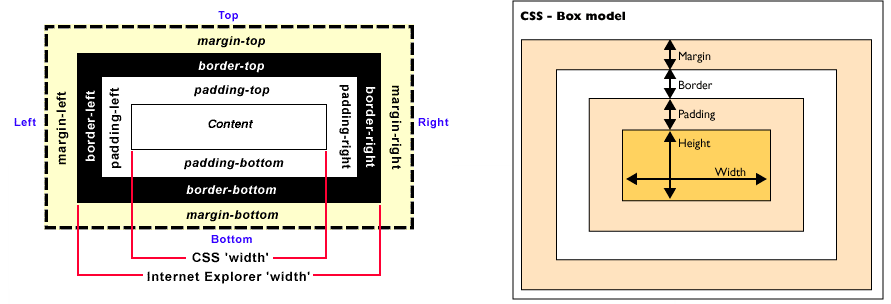
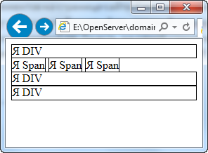
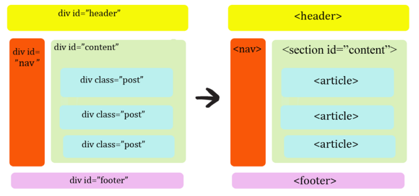

# Верстка

## Блочные и строчные элементы в CSS

**Блок** — это обычная прямоугольная область, обладающая рядом свойств, таких как: рамка, поля и отступы. Содержимым
блока,
может быть что угодно: кусок текста, картинка, видео-ролик, список, форма для заполнения, меню навигации и т.п.

**Рамка (border)** — это контур, для которого можно задать такие характеристики как толщина, цвет и тип (пунктирная,
сплошная, точечная). В отличие от таблиц вещь необязательная.

**Поля (padding)** — отделяют содержимое блока от его рамки, чтобы текст, например, не лепился тесно к стенкам блока.

**Отступы (margin)** — это пустое пространство между различными блоками, либо между блоком и стенками страницы сайта.
Они
позволяют расположить блоки на заданном расстоянии относительно друг друга.



## Тэг div

В отличии от стандартных HTML-тэгов к своему содержимому (`p` — к абзацам, `а` — к ссылкам, `img` — к изображениям), тэг
`div` является по-сути нейтральным. То есть ему всё равно, что содержать, хоть всё разом. Обычно тэг `div` используют
для задания больших функциональных областей на странице, таких как: шапка (в HTML5 это тег `header`), блок навигации
(в HTML5 это тег `nav`), блок(и) основного содержимого, футер (в HTML5 это тег `footer`) или подвал по-нашему и т.п.

Но может он применяться и к более мелким деталям сайта. И он также является парным: `<div></div>`
Чтобы различать однотипные тэги им были придуманы специальные атрибуты. Наиболее часто используют два вида:
идентификаторы (`id`) и классы (`class`).

`id` — атрибут, позволяющий придать тегу уникальный набор свойств, то есть такой, который на странице сайта используется
только один раз.
`class` — атрибут, который позволяет один и тот же набор свойств задать нескольким элементам на странице сайта.

Тэг `span`, так же как и `div`, является нейтральным. Он может применяться к любому элементу или группе элементов на
странице сайта. Главное отличие его от дива — характер размещения на странице. Если `div` — это чисто блоковый тэг,
который по-умолчанию не терпит соседства с другим блоком, то `span` — это строковый тэг. То есть, на одной строке может
размещаться подряд несколько "спанов", тогда как "дивы" стремятся залезть один под другой.



Блочные элементы характеризуются тем, что занимают всю доступную ширину, высота элемента определяется его содержимым, и
он всегда начинается с новой строки.

Строчными называются такие элементы веб-страницы, которые являются непосредственной частью другого элемента, например,
текстового абзаца. В основном они используются для изменения вида текста или его логического выделения.

Строчные элементы могут содержать только данные или другие строчные элементы, а в блочные допустимо вкладывать другие
блочные элементы, строчные элементы, а также данные. Иными словами, строчные элементы никак не могут хранить блочные
элементы (в HTML5 в строчный элемент ссылки `<a>` можно вкладывать блочные элементы).

Блочные элементы всегда начинаются с новой строки, а строчные таким способом не акцентируются.

Блочные элементы занимают всю доступную ширину, например, окна браузера, а ширина строчных элементов равна их
содержимому плюс значения отступов, полей и границ.

### Управление размерами контейнеров

`<div>` – контейнер представляет собой прямоугольную область. Значения высоты и ширины данной области определяются
такими стандартными атрибутами стилей, как:

- высота
  - `min-height` – задает минимальную высоту элемента;
  - `height` – задает высоту элемента;
  - `max-height` – задает максимально возможную высоту элемента;
- ширина
  - `min-width` – задает минимальную ширину элемента;
  - `width` – задает ширину элемента
  - `max-width` – задает максимально возможную ширину элемента.

Также допустимо использование следующих значений атрибутов управления размерами:

- `auto` – размер устанавливается в зависимости от размеров контента;
- `inherit` – значение наследуется от родителя.

### Управление размещением контейнеров

Для управления размещением элементов используется сетки и флексбоксы

Для структурной разметки html страницы, используют технологию **CSS Grid**

Скринкаст по технологии [CSS Grid](https://www.youtube.com/playlist?list=PLNkWIWHIRwMHlq6yOP65F_rNH5wID1U21)

[Игра для быстрого погружения](http://cssgridgarden.com/)

Также могут использовать спецификация CSS Flexible Box Layout Module (в народе Flexbox) позволяет контролировать размер,
порядок и выравнивание элементов по нескольким осям, распределение свободного места между элементами и многое другое.

Скринкаст по
технологии [CSS Flexbox](https://www.youtube.com/watch?v=O-ytfplFQ3c&list=PLNkWIWHIRwMG0EUBS8rvTRVNL9IcxcawW)

Если есть желание усвоить свойства `flexbox`, рекомендую вам пройти две игры.

[FLEXBOX FROGGY](http://flexboxfroggy.com/#uk)
[Flexbox Defense](http://www.flexboxdefense.com/)

[Шпаргалка](https://codepen.io/enxaneta/full/adLPwv/)

В HTML5 появилось несколько новых тегов, которые призваны заменить часто применяемые блоки div. В отличие от
универсального div, новые теги несут семантическую нагрузку, и строгое определение для каждого блока его место и роли:



- `<header> </header>` — Определяет область «шапки» сайта с логотипом, первичной навигацией и тд.;
- `<footer> </footer>` — Определяет «подвал», колонтитул веб страницы сайта или раздела, в котором обычно размещается
  дополнительная информация;
- `<section> </section>` — Определяет блок, который служит для группировки однотипных объектов, или для разделения
  текста на разделы;
- `<article> </article>` — Определяет автономную часть страницы, это может быть сообщение форума, журнала или газетную
  статью, запись в блоге и тд.;
- `<nav> </nav>` — Определяет область навигации, как правило список ссылок;

Семантическая вёрстка - это вёрстка с правильным использованием HTML-тегов. С использованием их по
назначению, как их и задумывали разработчики языка HTML и веб-стандартов. Например, тег `<p>` — это абзац, и не стоит
им размечать строки веб-форм. А `<b>` — это просто выделение текста жирным, а вовсе не заголовок.

## Viewport и scale

**Viewport** - это видимая пользователю область веб-страницы. Т.е. это то, что может увидеть пользователь, не прибегая к
прокрутке. Размеры этой области определяются размером экрана устройства.

Метатег `viewport` был разработан компанией Apple для того, чтобы указывать браузерам на то, в каком масштабе необходимо
отображать пользователю видимую область веб-страницы. Другими словами `viewport` предназначен для того, чтобы
веб-страницы отображались (выглядели) правильно (корректно) на смартфонах, планшетах и других устройствах с высокой
плотностью пикселей (>200ppi). Данный метатег предназначен в большой степени для адаптивных сайтов, но с помощью него
можно улучшить представления веб-страниц, имеющих фиксированную или гибкую разметку.
Рассмотрим использование метатега `viewport` для адаптивных сайтов.
Включение поддержки тега `<meta>` `viewport` для адаптивных сайтов осуществляется
посредством добавления всего одной строчки в раздел `head` веб-страницы:

```html

<meta name="viewport" content="width=device-width, initial-scale=1">
```

Атрибут `name` предназначен для того, чтобы указать браузеру, какую именно информацию о странице хотим ему сообщить. В
данном случае эта информация касается `viewport`. Контент (содержимое) этих сведений указывается в качестве значения
атрибута `content` посредством пар ключ-значение, разделённых между собой запятыми.
Для адаптивного дизайна значения атрибута `content` `viewport` должно определяться двумя параметрами:

```html
width=device-width, initial-scale=1
```

Первый параметр `width=device-width` отвечает за то, чтобы ширина видимой области веб-страницы равнялась CSS ширине
устройству (`device-width`). Эта ширина (CSS) - не физическое разрешение экрана. Это некоторая величина, независящая от
разрешения экрана. Она предназначена для того, чтобы мобильный адаптивный дизайн сайта отображался на всех устройствах
одинаково независимо от их плотности пикселей экрана. Второй параметр `initial-scale` - устанавливает первоначальный
масштаб веб-страницы. Значение `1` означает то, что масштаб равен 100%.

Если сайт не имеет адаптивный дизайн, то его представление на экране смартфона тоже можно улучшить. Можно сделать так,
чтобы ширина страницы масштабировалась под ширину устройства. Осуществляется это тоже с помощью установления параметру
`width` значения `device-width`. Т.е. для не адаптивных сайтов в раздел head необходимо добавить следующую строчку:

```html

<meta name="viewport" content="width=device-width">
```

## Сброс исходных стилей

Если мы создадим страницу на «голом» HTML без оформления и стилей, браузер все равно отобразит содержание тега `<h1>`
крупным и жирным, `<h2>` - чуть меньшим размером, выделит текст в теге `<i>` курсивом, `<u>` сделает подчеркнутым,
а `<b>`
-жирным.

Произойдёт так потому, что каждый браузер имеет по умолчанию некий набор базовых стилей, которые он применяет к странице
по умолчанию. И дело в том, что в разных браузерах эти правила немного отличаются. Лет 10 назад эти отличия были
кардинальными, и очень бросались в глаза. Сейчас они минимальны, но все же есть.

Чтобы убрать эти различия, и сделать по умолчанию отображение страницы во всех браузерах одинаковым - используются
специальные `.css` файлы: **Eric Meyer's CSS Reset** или [**Normalize.css**](https://necolas.github.io/normalize.css/)

Рекомендую использовать [Normalize.css](https://necolas.github.io/normalize.css/)

Normalize.css обеспечивает для HTML-элементов лучшую кроссбраузерность в стилях по умолчанию. Используя его, можно
сэкономить время. Он исправляет основные баги на мобильных и десктопных устройствах. Это включает в себя
параметры отображения элементов HTML5, исправление `font-size` для предварительно отформатированного текста, отображение
SVG в IE9, и многие другие баги, связанные с отображаемым в разных браузерах и операционных системах.
Файл разбит на относительно независимые участки, каждый из которых прокомментирован, что даёт вам возможность удалить
блоки свойств (например, нормализацию форм), если известно, что они никогда не понадобятся на сайте.
Помните, файл сброса/ нормализации стилей – это первое, что должен увидеть браузер! И только после него подключаются
остальные стили.

Но в целом для верстки - проще использовать готовые инструменты по типу [**Bootstrap**](https://getbootstrap.com/) —
свободный набор инструментов для создания сайтов и веб-приложений. Включает в себя HTML и CSS шаблоны оформления для
типографики, веб-форм, кнопок, меток, блоков навигации и прочих компонентов веб-интерфейсов, включая JavaScript
расширения.
